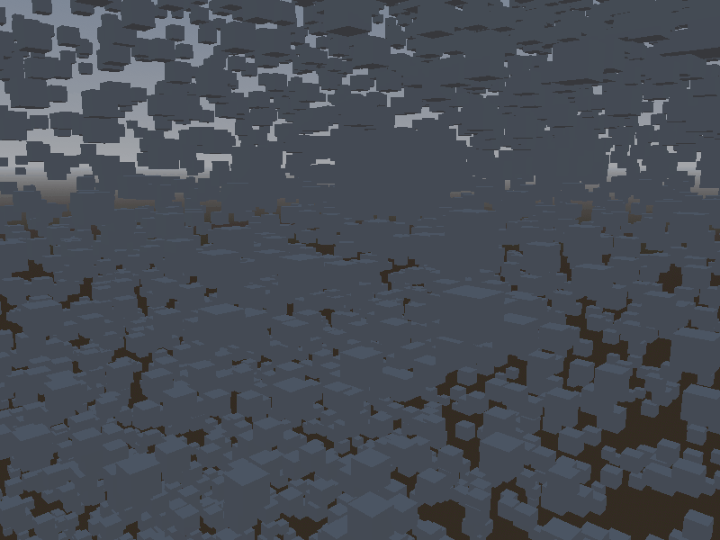

# Vecs

[]()



Vecs is an Entity Component System written in C# that aims to be lightweight and efficient.
- Makes use of Archetypes to handle association of entities to components
- Component data is stored contiguously in memory making it cache friendly

# Example
```C#
    using System;
    using Vecs;

    int instances = 1000000;
    World world = new World();
    Query query = new Query(world);
    Random random = new Random();
    for (int i = 0; i < instances; i++)
    {
        Entity entity = world.CreateEntity();
        query.AddComponent(entity, new Employee(i, $"GenericEmployee{i}", random.Next(1000, 10000)));
    }
    query.With(new Type[]{typeof(Employee)});

    query.Foreach((ref Employee employee) => 
    {
        Console.WriteLine($"{employee.Name}, {employee.Salary}");
    });

    struct Employee : IEquatable<Employee>
    {
        public int Id;
        public string Name;
        public int Salary;
        public Employee(int id, string name, int salary)
        {
            this.Id = id;
            this.Name = name;
            this.Salary = salary;
        }

        public bool Equals(Employee other)
        {
            return this.Id.Equals(other.Id);
        }
    }
```
