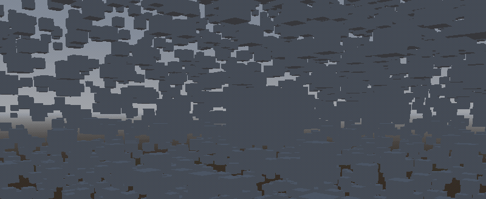

# Vecs

[]()



Vecs is an Entity Component System written in C# that aims to be performant.
- Makes use of Archetypes to handle association of entities to components
- Component data is stored contiguously in memory making it cache friendly

# Example
```csharp
using Vecs;

World world = new World(10);
Entity entity = world.CreateEntity(new Velocity(){Value = 0});
Query query = world.CreateQuery();
query.Get<Velocity>();
query.Foreach<Velocity>((ref Velocity velocity) =>
{
    velocity.Value = 1;
});


struct Velocity
{
    public float Value;
}
```
